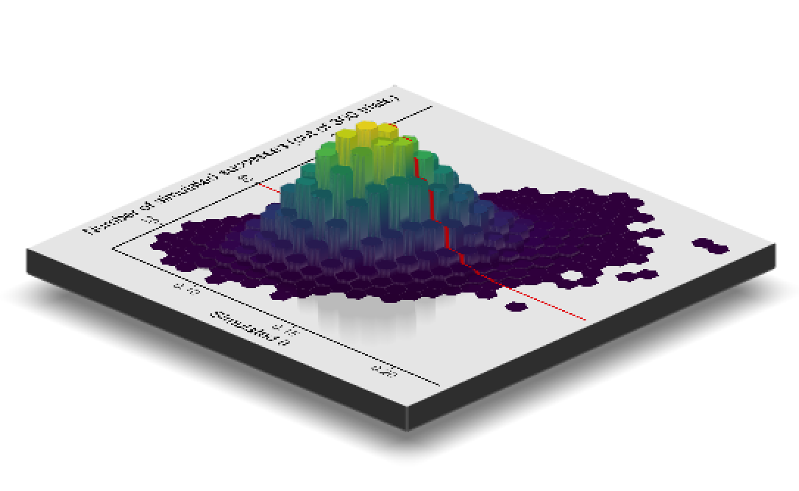

```{r setup, include=FALSE}
knitr::opts_chunk$set(echo = TRUE)
```

## Part 1

```{r message=FALSE, warning=FALSE}
library(tidyverse)
library(purrr)
library(magrittr)
library(viridis)
library(Biostrings)
```

 
```{r}
load("data/e100.RData")
e100

e100_tidy <- tibble(protein_position = 1:100, 
                    n_pos_epitope_tests = e100)
head(e100_tidy)
```

```{r fig.height = 2, fig.width = 3, fig.align = "center"}
e100_tidy %>% 
  ggplot(aes(x = protein_position, y = n_pos_epitope_tests)) + 
  geom_col(fill = "white", color = "black") + 
  theme_classic() + 
  labs(x = "Protein position (1-100)", 
       y = "Number of positive epitope tests\nacross 50 patient samples at this protein position")
```

```{r}
(e100_summary <- e100_tidy %>% 
  group_by(n_pos_epitope_tests) %>% 
  count())
```

```{r}
sim_poisson <- expand_grid(sample = 1:5, 
                           lambda = seq(from = 0.5, to = 3, by = 0.5)) %>% 
  mutate(sim_data = map(lambda, ~ rpois(n = 100, lambda = .x))) %>% 
  unnest(sim_data) %>% 
  group_by(sample, lambda, sim_data) %>% 
  count()

head(sim_poisson)
```

\newpage

```{r fig.width = 2.5, fig.height = 2, fig.align = "center"}
ggplot(filter(e100_summary, n_pos_epitope_tests != 7), 
       aes(x = n_pos_epitope_tests, y = n)) + 
  geom_col(fill = "chartreuse", color = "black") + 
  theme_classic() + 
  theme(axis.title = element_blank())
```


```{r}
ggplot(sim_poisson, aes(x = sim_data, y = n)) + 
  geom_col(fill = "chartreuse", color = "black") + 
  facet_grid(lambda ~ sample) + 
  theme_classic() + 
  theme(axis.title = element_blank())
```

\newpage

```{r}
tidy_loglike <- tibble(lambda = seq(from = 0.05, to = 0.95, length = 100)) %>% 
  mutate(data_prob = map(lambda, ~ dpois(e100, .x))) %>% 
  unnest(data_prob) %>% 
  mutate(log_prob_data = log(data_prob)) %>% 
  group_by(lambda) %>% 
  summarize(loglikelihood = sum(log_prob_data))

head(tidy_loglike)

tidy_loglike %>% 
  filter(loglikelihood == max(loglikelihood))
mean(e100)
```

```{r fig.height = 2.75, fig.width = 2.5, fig.align = "center"}
ggplot(tidy_loglike, aes(x = lambda, y = loglikelihood)) + 
  geom_line() + 
  theme_classic() + 
  labs(x = expression(lambda), y = "Log-likelihood") + 
  geom_vline(xintercept = mean(e100), color = "purple")
```

\newpage

```{r}
staph <- readDNAStringSet("data/staphsequence.ffn.txt")
class(staph)

staph 
staph[1]
class(staph[1])
staph[[1]]
class(staph[[1]])
```

```{r}
letterFrequency(staph[[1]], letters = c("A", "C", "G", "T"))
```

\newpage

## Part 2

Say you think that the **parameter** for your probability distribution isn't
certain. Instead, you think it is a random variable from a beta distribution 
with parameters: $\alpha$ = 50, $\beta$ = 350. 

First, here's that beta distribution: 

```{r}
beta_dist <- tibble(x = seq(from = 0, to = 1, length = 100)) %>% 
  mutate(value = map_dbl(x, ~ dbeta(x = .x, shape1 = 50, shape2 = 350)))
beta_dist %>% 
  head()
```

```{r fig.width = 3, fig.height = 2, fig.align = "center"}
ggplot(beta_dist, aes(x = x, y = value)) + 
  geom_line() + 
  geom_vline(xintercept = 50 / (50 + 350), 
             linetype = 3) # Theoretical mean of this distribution is alpha / alpha + beta
```

Now, if we want to try to simulate what **outcomes** from this process might look like, 
we'll do a two-step simulation: 

1. Simulate different values of the parameter for the binomial distribution,
*since we now think that this parameter is itself a random variable* (this is
the part 1 of the heart of the Bayesian paradigm for this example). We think this parameter
follows a **beta distribution**, with parameters of $\alpha$ = 50 and $\beta$ =
350, so we'll draw random samples from that distribution for this step.
2. Once we have a lot of random samples of this parameter value from step 1, 
we can take random draws from binomial distributions to simulate the actual 
data. We will simulate in this case from *lots* of examples of the binomial 
distribution family, using the parameters from step 1. 

Step 1: 

```{r}
bayesian_simulation <- tibble(index = 1:100000, 
                              rtheta = rbeta(100000, 50, 350))

bayesian_simulation %>% 
  head()
```

Here's a histogram of the $\theta$ values for that draw:

```{r fig.width = 3, fig.height = 2, fig.align = "center"}
ggplot(bayesian_simulation, aes(x = rtheta)) + 
  geom_histogram(bins = 50, fill = "gray", color = "black") + 
  theme_classic() + 
  scale_x_continuous(name = expression(theta)) + 
  scale_y_continuous(name = "Frequency", labels = scales::comma)
```

Step 2: 

Next, for *each* of these simulated $\theta$ values (which, again, represent the 
parameter of a binomial distribution), we'll simulate the count of successes from 
a binomial experiment with 300 trials. 

Remember that, if we were pretty sure that the data came from a binomial distribution
with p = 0.10 (i.e., a 10% chance of success), here's how we would simulate the result
of an experiment with 300 trials: 

```{r}
rbinom(n = 1, size = 300, prob = 0.10)
```

Now we'll just do this process for every value of $\theta$ that we got from sampling
the beta distribution in step 1: 

```{r}
bayesian_simulation <- bayesian_simulation %>% 
  mutate(sim_successes = map_dbl(rtheta, ~ rbinom(n = 1, prob = .x, size = 300)))
bayesian_simulation %>% 
  head()
```

Now we can look at a histogram of these simulated number of successes from step 2: 

```{r fig.width = 3, fig.height = 2, fig.align = "center"}
ggplot(bayesian_simulation, aes(x = sim_successes)) + 
  geom_histogram(bins = 32, fill = "orange", color = "black") + 
  theme_classic() + 
  scale_x_continuous(name = "Number of successes in the experiment") + 
  scale_y_continuous(name = "Frequency", labels = scales::comma)
```

This is an example of a simulation where we think that both the model parameter
($\theta$) and the outcomes are random variables. 

## Adding in observed data

Now, we can try to update our belief about the probability distribution (in this
case, by updating our belief about the distribution of the $\theta$ parameter) by 
*adding what we can learn from new data* (this is the second part of the heart
of the Bayesian paradigm in this example). For example, the expected value of 
$\theta$ is, we think before we see any new data, about 0.125 
(this is $\frac{\alpha}{\alpha + \beta}$ from the values we used for the prior
beta distribution for $\theta$). 

If we have data where the probability of success
is closer to 20%, we want our **updated** distribution for $\theta$ to have a higher
expected value. If we observe in new data a probability of success that is 10%, 
on the other hand, we want the update distribution to have a lower expected value. 
If we have observed data with a probability of success right around 12.5%, 
then that should give us more confidence that this is a good expected value of
$\theta$, so we won't want the expected value to change, but we would like the
distribution to get "sharper"---we're becoming more confident that the value is 
close to its expected value in that case. 

In the example, we **observe data** where, out of 300 trials, there are 40 
successes. This is a proportion of successes of $\frac{40}{300} = 0.133$. 
This is a little higher than the expected value in our prior distribution, so 
we should already know that when we add in the information from this new data, 
our beta distribution for $\theta$ should shift a little to the left. 

Here's how we can "add" this data based on our simulated data: 
we can look *just* at the simulated values where the number of successes reflect
our observed data (that is, where there are 40 simulated successes): 

```{r}
post_data <- bayesian_simulation %>% 
  filter(sim_successes == 40)
dim(post_data)
head(post_data)
```

Here is a histogram of the values of $\theta$ in our simulation that resulted in 
40 successes in the second step of the simulation:

```{r fig.width = 3, fig.height = 2, fig.align = "center"}
ggplot(post_data, aes(x = rtheta)) + 
  geom_histogram(bins = 50, fill = "chartreuse", color = "black") + 
  theme_classic() + 
  scale_x_continuous(name = expression(theta)) + 
  scale_y_continuous(name = "Frequency", labels = scales::comma)
```

Here's another way to think of this: if we looked at the **bivariate distribution**
of the simulations, looking at how the frequency of observed values vary by both 
the simulated $\theta$ value and the simulated count of successes based on that
$\theta$, then we now want to take a "slice" along that bivariate distribution
right at the point where the number of successes is 40: 

```{r fig.width = 4, fig.height = 2.5, fig.align = "center"}
biv_dist <- ggplot(bayesian_simulation, aes(x = rtheta, y = sim_successes)) + 
  geom_hex(bins = 20, size = 0) + 
  scale_fill_viridis(name = "Frequency") + 
  theme_classic() + 
  labs(x = expression(paste("Simulated ", theta)), 
       y = "Number of simulated successes\n(out of 300 trials)") + 
  geom_hline(yintercept = 40, color = "red")
biv_dist
```

(If you'd like to try this in 3-D, you can do that now with the `rayshader` package:)

```{r eval = FALSE}
library(rayshader)
plot_gg(biv_dist + theme(legend.position = "none"),
        width = 4, height = 4, scale = 300, multicore = TRUE)
```

```{r echo = FALSE, fig.align = "center", out.width = "0.8\\textwidth"}

```

It turns out that there's a really nice theoretical solution for the posterior
distribution if the prior distribution for the parameter was a beta distribution. 
It turns out that, if in your data you observe $y$ successes out of $n$ trials, 
then your posterior distribution for $\theta$ is also a beta distribution, this 
time with the first size parameter of $\alpha + \beta$ and the second size
parameter of $\beta + (n - y)$. 

We can create values from that distribution and add this as a line to the results
from our simulation to see that the theoretical and simulated results agree pretty 
well: 

```{r fig.width = 3, fig.height = 2, fig.align = "center"}
beta_dist_post <- tibble(x = seq(from = 0.05, to = 0.2, length = 100)) %>% 
  mutate(value = map_dbl(x, ~ dbeta(x = .x,
                                    shape1 = 50 + 40, shape2 = 350 + (300 - 40)))) 

ggplot(post_data, aes(x = rtheta)) + 
  geom_histogram(bins = 50, fill = "chartreuse", color = "black") + 
  theme_classic() + 
  scale_x_continuous(name = expression(theta)) + 
  scale_y_continuous(name = "Frequency", labels = scales::comma) + 
  geom_line(data = beta_dist_post, aes(x = x, y = 15 * value), color = "red")
```

For the maximum a posteriori (MAP) estimate, based on simulation, it's just the 
most common value of the $\theta$s from the simulation that resulted in 40 successes 
in the simulation: 

```{r}
post_data %>% 
  mutate(round_rtheta = round(rtheta, digits = 3)) %>% 
  group_by(round_rtheta) %>% 
  count() %>% 
  arrange(desc(n)) %>% 
  head()
```

You can use quantiles of the simulations to get the 95% posterior credibility interval:

```{r}
post_data %>% 
  summarize(lower_pi = quantile(rtheta, 0.025),
            upper_pi = quantile(rtheta, 0.975))
```

## Example: nucleotide patterns

```{r messages = FALSE, warning = FALSE}
library("Biostrings")
library("BSgenome")
```

```{r}
available.genomes() %>% 
  str_subset("Hsapiens") # You can use regular expressions to pull out human genome data
```

If you don't have the package with E. coli data yet, you'll need to install it from
Bioconductor (uncomment the first line below). The library loads an object called 
`Ecoli` with the E. coli genome data. You can use `str` to check this out. 

```{r}
# BiocManager::install("BSgenome.Ecoli.NCBI.20080805") 
library("BSgenome.Ecoli.NCBI.20080805")
class(Ecoli)
str(Ecoli)
```

It looks like we're going to pull out the sequence for one strain based on its NCB accession 
number:

```{r}
ecoli <- Ecoli$NC_010473
class(ecoli)
str(ecoli)
head(ecoli)
```

```{r}
shineDalgarno <- "AGGAGGT"
window <- 50000

num_matches <- tibble(start = seq(from = 1, to = length(ecoli) - window, by = window)) %>% 
  mutate(end = start + window - 1) %>% 
  mutate(n_matches = map2_dbl(start, end, ~ countPattern(shineDalgarno,
                                                     ecoli[.x:.y], 
                                                     max.mismatch = 0)))
head(num_matches)
```

```{r fig.width = 3, fig.height = 2, fig.align = "center"}
ggplot(num_matches, aes(x = n_matches)) + 
  geom_histogram(binwidth = 0.5) + 
  theme_classic() + 
  labs(x = "Number of matches within a window", 
       y = "Frequency")
```

As an alternative to using `table`, you can `group_by` and `count`:

```{r}
num_matches %>%
  group_by(n_matches) %>% 
  count()
```


Here's another way of plotting the data that might help you look for patterns in 
where the matches to the motif are most common:

```{r fig.width = 10, fig.height = 2, fig.align = "center"}
ggplot(num_matches, aes(x = start, y = 1)) + 
  geom_tile(aes(fill = n_matches)) + 
  theme_classic() + 
  theme(legend.position = "top",
        axis.title.y = element_blank(),
        axis.text.y = element_blank(),
        axis.ticks.y = element_blank(),
        axis.line.y = element_blank()) + 
  scale_fill_viridis(name = "# of matches to Shine-\nDalgarno motif in the window") + 
  scale_x_continuous(name = "Position of window start", labels = scales::comma) 
```

